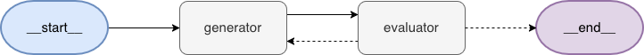
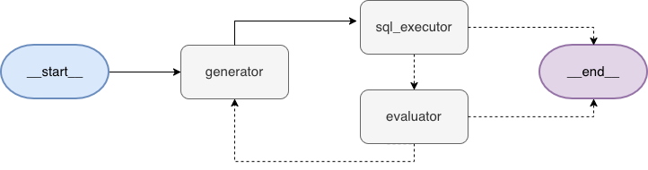

# nl2sql-reflexion

nl2sql : Natural Language to SQL

LangGraph agent that translates natural language questions to SQL queries with self-correction. Compares a simple loop (Reflection) against one with memory across questions (Reflexion).

The project is constructed in two different stages:

- Phase 1: Reflection agent (**current**).
- Phase 2: Reflexion agent.

For the demos I use the [Chinook database](https://github.com/lerocha/chinook-database/tree/master), a database consisting of music catalogue. For simplicity I focus only on a subschema consisting of four tables: Artist, Album, Track, Genre.

The agent should be able to return answers for questions such as:

- _How many albums does AC/DC have?_
- _List all the songs from Metallica's album '...And Justice For All'_
- _Who is the artist with the most songs?_
- _How many tables are in the database?_

## Quickstart

**Requirements:** Python 3.11+, [uv](https://docs.astral.sh/uv/), an OpenAI API Key.

1. Clone the repo and install dependencies:

```bash
git clone https://github.com/saacbj/nl2sql_reflexion.git
cd nl2sql-reflexion
uv sync
```

2. Initialize the database

```bash
sqlite3 data/chinook.sqlite < data/Chinook_Sqlite.sql
```

3. Create a `.env` with your API Key and the path to the `chinook.sqlite` file:

```
OPENAI_API_KEY=your-key-here
DB_PATH=path-to-the-chinook.sqlite-file
```

The script uses by default `gpt-4o-mini`.

4. Run the agent:

```bash
uv run code/main.py
```

## Phase 1: Reflection agent with external feedback

The first phase of this project consists of a Reflection agent that generates, runs, and improves (if required) an SQL query parting from a question asked by the user.

A simple Reflection Agent (as is described in [LangChain's ](https://www.langchain.com/blog/reflection-agents) blog) consists a two-nodes architecture: a generator and a evaluator. First, the generator recieves the prompt from the user (e.g. asking for a tweet with certain topics) and generates a first response. Then, this generation is sent to the evaluator, who creates a critique of the first response. This critique is sent back to the generator, who generates a second iteration of the material taking into account the critique provided by the evaluator.



Due to a lack of external evaluation, in this setting the evaluator _'guesses'_ if the content provided by the generation is correct or not. That is to say, the evaluator may generate critique even if the content coming from the generator is already suitable for the task. This may be beneficial for subjective tasks, but for tasks such as the one this project tackles it might be disadvantageous.

In order to circumvent this issue, the architecture for this agent considers an addional node whose objective is to provide external feedback to the evaluator.

### Architecture

Due to the deterministic and objective nature of the task (SQL queries), an external source of evaluation is added to the Reflection architecture in the form a `sql_executor` node. This node doesn't make any calls to the LLM, it simply runs the query provided by the generator and catches any error if they were to occur.



In this setting, both the `sql_executor` node and the `evaluator` node have conditional edges to the `END` node.

For the `sql_executor` the condition to go to the `END` node is if the query didn't raised any errors. On the other hand, if there was an error, this information is passed to the `evaluator` to provide additional instructions to the `generator`, unless it has reached a maximum amount of generations (hardcoded to 5).

### Testing the agent

**Example 1.**
_Who is the classical music artist with the most albums?_

[LangSmith Trace](https://smith.langchain.com/public/abdfe674-d63c-4bb3-8306-e10f11c18b42/r/01a07032-eca6-75a0-9e97-bac3d9c7bafa?start_time=2026-09-05T06%3A13%3A00.710243Z)


<details>
<summary>Full output from the terminal (formatted)</summary>

**Response:** ('Eugene Ormandy', 3)

**Using the query:**

```sql
SELECT a.Name, COUNT(al.AlbumId) AS AlbumCount
FROM Artist a
JOIN Album al ON a.ArtistId = al.ArtistId
JOIN Track t ON al.AlbumId = t.AlbumId
JOIN Genre g ON t.GenreId = g.GenreId
WHERE g.Name = 'Classical'
GROUP BY a.ArtistId, a.Name
ORDER BY AlbumCount DESC
LIMIT 1;
```

**After 1 attempt(s).**

</details>

<details>
<summary>Discussion</summary>
A 4-table JOIN (Artist–Album–Track–Genre) resolved correctly on the first attempt.
</details><br>

**Example 2.**
_Is Santana in the database?_

[LangSmith Trace](https://smith.langchain.com/public/74a71782-ee05-432f-a128-a774daef62ae/r/01a07035-8c82-74c0-9047-e1e63d4951dd?start_time=2026-09-05T06%3A15%3A52.70667Z)


<details>
<summary>Full output from the terminal (formatted)</summary>

**Response:** (59, 'Santana')

**Using the query:**

```sql
SELECT * FROM Artist WHERE Name = 'Santana';
```

**After 1 attempt(s).**

</details>

<details>
<summary>Discussion</summary>
A simple solution included as a contrast to the other examples: no aggregation, no JOIN, resolved instantly.
</details><br>

**Example 3.**
_Who is the artist with the most songs and who the one with the most albums?_

[LangSmith Trace](https://smith.langchain.com/public/9cfdff04-e1b5-4986-9369-f8fdc9515724/r/01a07044-eca7-7272-be43-f08647d80203?start_time=2026-09-05T06%3A32%3A40.359307Z)


<details>
<summary>Full output from the terminal (formatted)</summary>

**Response:** ('Iron Maiden', 213, 21)

**Using the query:**

```sql
WITH SongCounts AS (
    SELECT Artist.ArtistId, Artist.Name AS ArtistName, COUNT(Track.TrackId) AS SongCount
    FROM Artist
    JOIN Album ON Artist.ArtistId = Album.ArtistId
    JOIN Track ON Album.AlbumId = Track.AlbumId
    GROUP BY Artist.ArtistId
),
AlbumCounts AS (
    SELECT Artist.ArtistId, COUNT(Album.AlbumId) AS AlbumCount
    FROM Artist
    JOIN Album ON Artist.ArtistId = Album.ArtistId
    GROUP BY Artist.ArtistId
)

SELECT
    S.ArtistName,
    S.SongCount,
    A.AlbumCount
FROM SongCounts S
JOIN AlbumCounts A ON S.ArtistId = A.ArtistId
ORDER BY S.SongCount DESC, A.AlbumCount DESC
LIMIT 1;
```

**After 2 attempt(s).**

````
========================================
----- Attempt 1 -----
Query:
SELECT Artist.Name AS ArtistName, COUNT(Track.TrackId) AS SongCount
FROM Artist
JOIN Album ON Artist.ArtistId = Album.ArtistId
JOIN Track ON Album.AlbumId = Track.AlbumId
GROUP BY Artist.ArtistId
ORDER BY SongCount DESC
LIMIT 1;


SELECT Artist.Name AS ArtistName, COUNT(Album.AlbumId) AS AlbumCount
FROM Artist
JOIN Album ON Artist.ArtistId = Album.ArtistId
GROUP BY Artist.ArtistId
ORDER BY AlbumCount DESC
LIMIT 1;
Error: You can only execute one statement at a time.
Critique: The error you're encountering is due to the fact that you're trying to execute two separate SQL statements sequentially. Many SQL interfaces only allow one statement at a time unless you're using a database management system that supports running multiple queries in a single call (e.g., using a transaction). However, the best practice is to combine results using a single query whenever possible.

To resolve this and obtain the information you need about the artist with the most songs and the artist with the most albums in one query, you can use Common Table Expressions (CTEs) or subqueries. Here's a critique of how to rewrite your query using CTEs for clarity and efficiency:

1. Use CTEs to compute the count of songs and the count of albums in a single run.
2. You can then join these CTEs or simply select from them to get the desired output.

Here's an example of how to structure your query:

```sql
WITH SongCounts AS (
    SELECT Artist.ArtistId, Artist.Name AS ArtistName, COUNT(Track.TrackId) AS SongCount
    FROM Artist
    JOIN Album ON Artist.ArtistId = Album.ArtistId
    JOIN Track ON Album.AlbumId = Track.AlbumId
    GROUP BY Artist.ArtistId
),
AlbumCounts AS (
    SELECT Artist.ArtistId, COUNT(Album.AlbumId) AS AlbumCount
    FROM Artist
    JOIN Album ON Artist.ArtistId = Album.ArtistId
    GROUP BY Artist.ArtistId
)

SELECT
    S.ArtistName,
    S.SongCount,
    A.AlbumCount
FROM SongCounts S
JOIN AlbumCounts A ON S.ArtistId = A.ArtistId
ORDER BY S.SongCount DESC, A.AlbumCount DESC
LIMIT 1;
```

This query defines two CTEs: `SongCounts` and `AlbumCounts` to count songs and albums respectively. You can then join these results and order by the song count to get the artist with the most songs along with their album count.

This method avoids the need to execute multiple statements and effectively gives you the desired results in a single, cohesive query.
========================================
````

</details>
<details>
<summary>Discussion</summary>

This examples serves as evidence in this project that Reflection based on execution error cannot catch semantically wrong-but-plausible SQL.

The corrected query is syntactically valid and returns the _"correct"_ answer for this dataset, but its logic is flawed: the JOIN between SongCounts and AlbumCounts forces both counts to come from the same artist. It only works because Iron Maiden happens to top both.

In a [separate run of this same question](https://smith.langchain.com/public/2327fde6-b754-4b47-893f-8077ff8e710d/r/01a06fc9-a172-7730-b451-61e4c0a8df52?start_time=2026-09-05T04%3A18%3A00.178907Z), the model produced a genuinely correct query using two independent scalar subqueries instead of a JOIN. It is important no note that this comparison is simply anecdotal.

</details><br>

**Example 4.**
_List all the songs from Metallica's album '...And Justice for All'_

[LangSmith Trace (first try)](https://smith.langchain.com/public/3ad5ec9a-938c-4876-8139-03f21a6c15dc/r/01a0703a-a887-7e72-846d-5be5e8924d8b?start_time=2026-09-05T06%3A21%3A27.559479Z)<br>
[LangSmith Trace (second try)](https://smith.langchain.com/public/31b0a335-2347-4723-b47c-ef12f57a0605/r/01a0703a-c2c6-7702-a3f2-dc9e26f61f64?start_time=2026-09-05T06%3A21%3A34.278174Z)


<details>
<summary>Full output from the terminal (formatted)</summary>

_First try_<br>
**Response:**
**Using the query:**

```sql
SELECT Track.Name
FROM Track
JOIN Album ON Track.AlbumId = Album.AlbumId
JOIN Artist ON Album.ArtistId = Artist.ArtistId
WHERE Artist.Name = 'Metallica' AND Album.Title = '...And Justice for All';
```

**After 1 attempt(s).**

_Second Try_

**Response:**

- Blackened
- ...And Justice For All
- Eye Of The Beholder
- One
- The Shortest Straw
- Harvester Of Sorrow
- The Frayed Ends Of Sanity
- To Live Is To Die
- Dyers Eve

**Using the query:**

```sql
SELECT Track.Name
FROM Track
JOIN Album ON Track.AlbumId = Album.AlbumId
JOIN Artist ON Album.ArtistId = Artist.ArtistId
WHERE Artist.Name = 'Metallica' AND Album.Title = '...And Justice For All';
```

**After 1 attempt(s).**

</details>
<details>
<summary>Discussion</summary>

This examples helps to illustrate another flaw with this agent design: the lack of a revisor for the results means the agent only reacts to hard failures, never to silently wrong results. In particular, this example falls into this blind spot by also showing that in some cases the agent may search for terms as they were given by the user.

The first attempt (_... for All_) returns an empty result, not an error: SQLite's default string comparison is case-sensitive, and the database stores the title with a capital "For". Because no exception is raised, execution_error stays None and the current architecture treats this as success.

On the other hand, in the second try the agent is prompted with the corrected capitalization. It is important to notice that this is not an automatic retry by the agent but a manual retry.

</details><br>

---

## Future Work

- [ ] Add a soft condition for the `execute_sql` - `evaluator` node to detect suspicious results that did not raise any Exception (e.g. first try of example).
- [ ] Add a tool for the `evaluator` node that allows the llm to consult metadata from the DB in runtime. This could be helpful to simulate wrong names of columns or tables provided by the user.
- [ ] Try a local quantized model (using Ollama) for the `generator`. I'd like to see if a _less_ capable model may trigger the `evaluator` nodes more times and if it would be able to resolve the raise exceptions. In this case I tried only OpenAI's models to include API calls in the project and improve reproducibility.

---

## Technologies used in this project

- LangChain
- LangGraph
  - Conditional nodes
- SQLite
